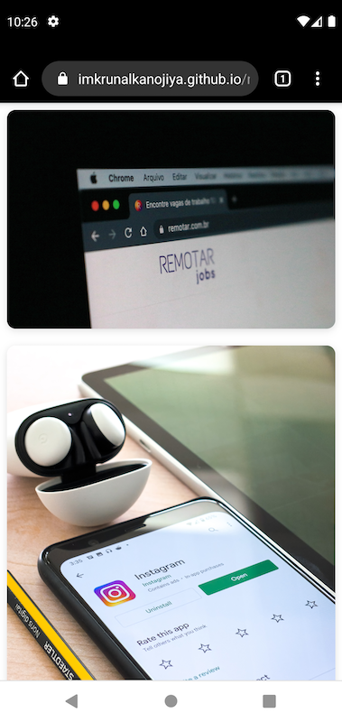

# React Masonry View

React Masonry View is responsive react library for showing simple masonry.


## Features

- Responsive
- Lightweight


## Installation

Install with npm

```bash
  npm install react-masonry-view

```

Install with yarn

```bash
  yarn add react-masonry-view
```
    
## Usage/Examples

```javascript
import { MasonryView } from 'react-masonry-view'
import 'react-masonry-view/dist/index.css'

function App() {
  const imgArray = [
    {
      id: 1,
      imgUrl: "https://source.unsplash.com/random"
    },
    {
      id: 2,
      imgUrl: "https://source.unsplash.com/random"
    },
    {
      id: 3,
      imgUrl: "https://source.unsplash.com/random"
    },
    {
      id: 4,
      imgUrl: "https://source.unsplash.com/random"
    }
  ]
  return <MasonryView imgDetails={imgArray} />
}
```

## Live Demo

[Live Demo](https://imkrunalkanojiya.github.io/react-masonry-view/)

## Screenshot/Demo

### Desktop View


### Mobile View




## License

MIT © [imkrunalkanojiya](https://github.com/imkrunalkanojiya)
